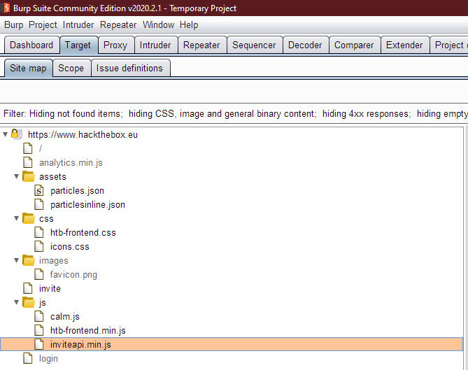
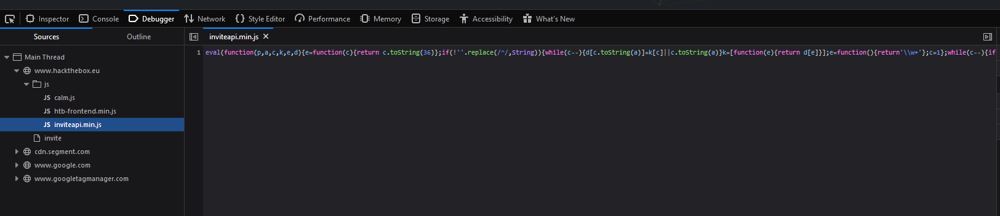
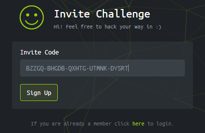
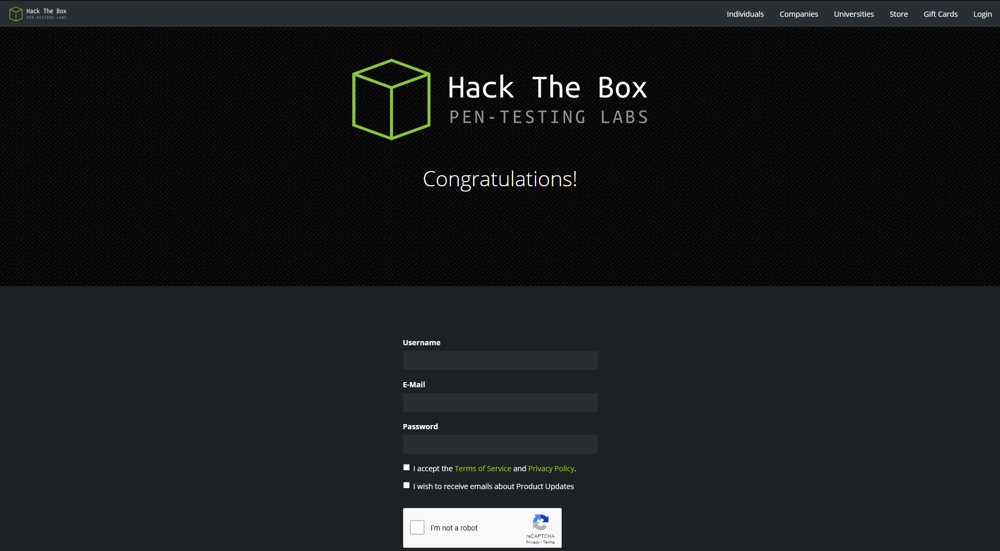

# Invite challenge

## Where?

https://www.hacktheboxhackthebox.eu/invite

## What?

Figure out how to sign up to htb.

## How?

Going to the page (https://www.hackthebox.eu/invite), we are greeted by a cheeky
message:


So first things first, we start up
[Burp Suite](https://portswigger.net/burp/communitydownload) to get a nice read
on the website.

Now we can mess around sending random things to the sign up form and check what
is actually happening using burp, which by now should generated some useful
sitemap data for us to explore 😉



The first thing that should catch your attention is `inviteapi.min.js`! There's
an API to this thing??

Now if we visit that URL (https://www.hackthebox.eu/js/inviteapi.min.js), or
check our developer tools on Firefox we can see the source code of that `js`
file:



This is pretty unreadable. We can guess though that by plopping this into a
[js beautifier](https://beautifier.org) we can get a more readable result:

```js
function verifyInviteCode(code) {
    var formData = {
        "code": code
    };
    $.ajax({
        type: "POST",
        dataType: "json",
        data: formData,
        url: '/api/invite/verify',
        success: function(response) {
            console.log(response)
        },
        error: function(response) {
            console.log(response)
        }
    })
}

function makeInviteCode() {
    $.ajax({
        type: "POST",
        dataType: "json",
        url: '/api/invite/how/to/generate',
        success: function(response) {
            console.log(response)
        },
        error: function(response) {
            console.log(response)
        }
    })
}
```

Now we have two endpoints to work with:

- `POST /api/invite/verify`
- `POST /api/invite/how/to/generate`

My first wild guess would be, `/verify` is the function that is used to verify
the entered invite code, while `/how/to/generate` could give us a clue on how to
get such an invite code. So, let's just try it!

```bash
# -s flag: silent mode, no progress meter or error messages
# -X flag: set method (here POST)
# json_pp is optional, just makes the output cleaner
curl -sX POST https://www.hackthebox.eu/api/invite/how/to/generate | json_pp
```

Ooh! We get something in return (one of these two, usually):

```json
{
    "data" : {
        "enctype" : "ROT13",
        "data" : "Va beqre gb trarengr gur vaivgr pbqr, znxr n CBFG erdhrfg gb /ncv/vaivgr/trarengr"
    },
    "0" : 200,
    "success" : 1
}
```
```json
{
    "success" : 1,
    "data" : {
        "enctype" : "BASE64",
        "data" : "SW4gb3JkZXIgdG8gZ2VuZXJhdGUgdGhlIGludml0ZSBjb2RlLCBtYWtlIGEgUE9TVCByZXF1ZXN0IHRvIC9hcGkvaW52aXRlL2dlbmVyYXRl"
    },
    "0" : 200
}
```

We can see that we can get at least two different responses of varying
encodings:

- [rot13](https://en.wikipedia.org/wiki/ROT13)
- [base64](https://en.wikipedia.org/wiki/Base64)

We can easily decode both of these using the terminal:

```bash
# rot13: using tr we can shift the letters back to their original
echo "Va beqre gb trarengr gur vaivgr pbqr, znxr n CBFG erdhrfg gb /ncv/vaivgr/trarengr" | tr 'A-Za-z' 'N-ZA-Mn-za-m'
# result:
In order to generate the invite code, make a POST request to /api/invite/generate

# base64: using base64 with the -d flag (decode)
echo "SW4gb3JkZXIgdG8gZ2VuZXJhdGUgdGhlIGludml0ZSBjb2RlLCBtYWtlIGEgUE9TVCByZXF1ZXN0IHRvIC9hcGkvaW52aXRlL2dlbmVyYXRl" | base64 -d
# result:
In order to generate the invite code, make a POST request to /api/invite/generate
```

Well.. that couldn't be clearer, could it?

```bash
# same comments as before
curl -sX POST https://www.hackthebox.eu/api/invite/generate | json_pp
```

Result:

```json
{
    "success" : 1,
    "0" : 200,
    "data" : {
        "format" : "encoded",
        "code" : "QlpaR1EtQkhHREItUVhIVEctVVRNTkstRFlTUlQ="
    }
}
```

We can tell that this is encoded thanks to the `format` field. We can
assume that this is encoded in `base64` because the data ends with an
equals (`=`) sign, usually a dead giveaway!

```bash
# same deal as before
echo "QlpaR1EtQkhHREItUVhIVEctVVRNTkstRFlTUlQ=" | base64 -d
# result:
BZZGQ-BHGDB-QXHTG-UTMNK-DYSRT
```

Well.. that definitely looks like a `code` to me...



Et viola! We're in!


